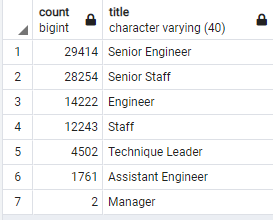
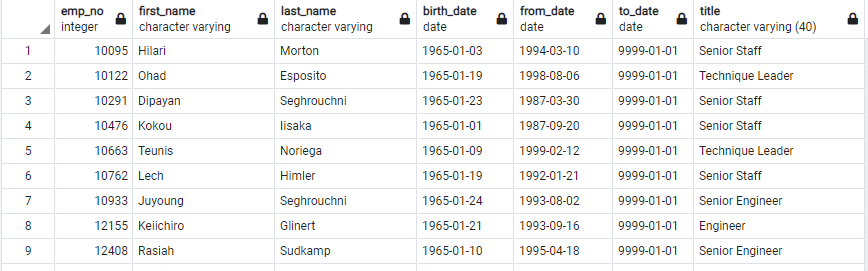
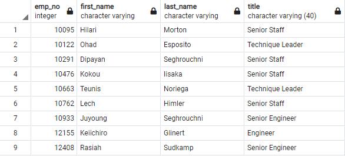
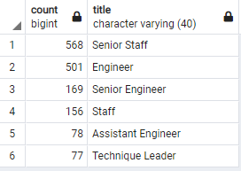

# Pewlett Hackard Analysis
## Purpose
Bobby's manager is now requesting Bobby to do two more tasks with the data and Bobby needs our help. His manager needs us to figure out the number of retiring employees for each title. Also, Bobby's manager requests us to find employees that are eligible for the mentorship program. Lastly, write an analysis for Bobby's manager to help prepare for the upcoming employee’s retirements.
## Results
- The retirement_titles table shows all employees that are soon to retire. It shows their title, when they started working in their position, and when they left there position.
- The unique_titles table shows all soon to retire employees and what their current positions are.
- In the image below, we can see the distribution of soon to retire employees based upon their titles. The majority of employees have senior positions with 20,000 employees retiring soon for each. Both Senior Engineers and Senior Staffers make up 63.8% of those retiring (57,668/90,398*100 = 63.79%).\

- In the link below, it's a table showing the employees that are eligible for the mentorship program. These employees were born in 1965. Since those that are retiring soon were born between 1952 and 1955, we need a group of people at an age that have experience but also be around for a while longer. Therefore, employees born in 1965 are the perfect candidates to help mentor people to fill the soon to be open positions.
Mentorship Eligibility Table: 
## Summary
After the "silver tsunami" hits, there will be many roles that will need to be filled. The majority of roles will be senior roles as they make up 63.8% of those retiring. Our focus should be to try and fill these positions first. Then go to the non-senior positions and fill those. Based upon the head (first 9 rows of the mentorship eligibility table), we can see over half have senior positions. If it that statement continues to be true for the entire chart, then we have enough qualified and retirement-ready employees in each department to mentor the next generation.\
Here is another chart of the mentorship eligibility employees:
\
This is an easier chart to read to see what employees are eligible for the mentorship program and what their titles are.\
Here is a chart that shows the distribution of titles for those who are eligible for the mentor ship program:
\
